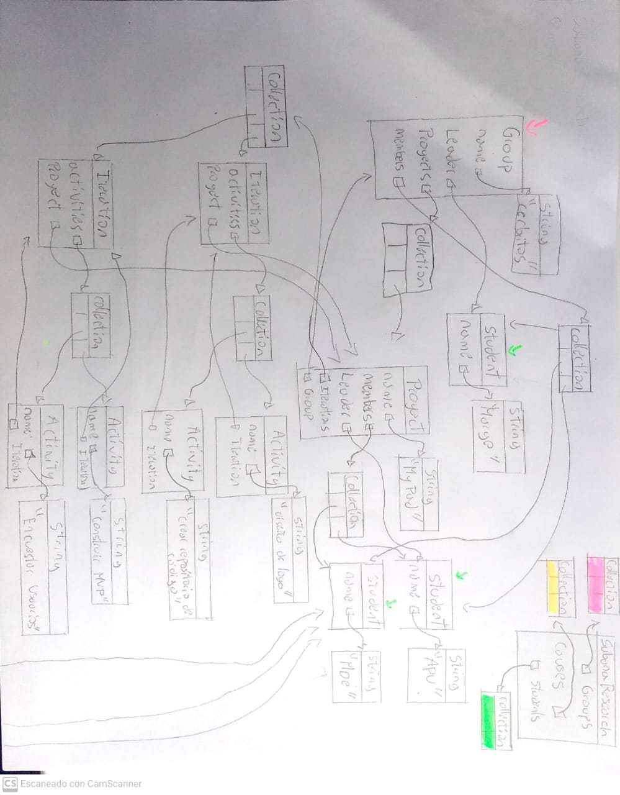
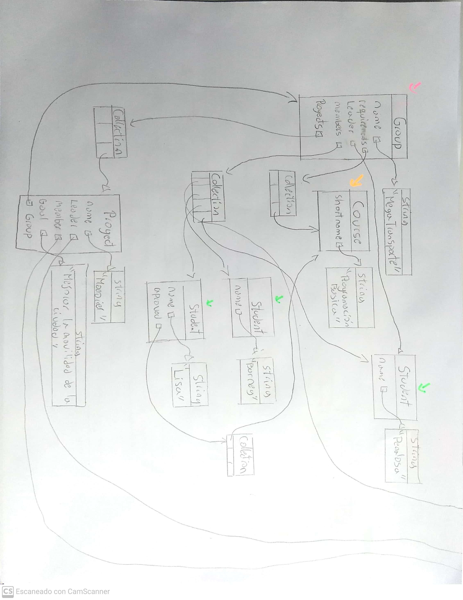
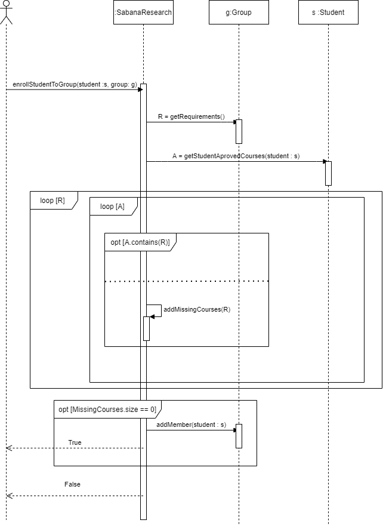
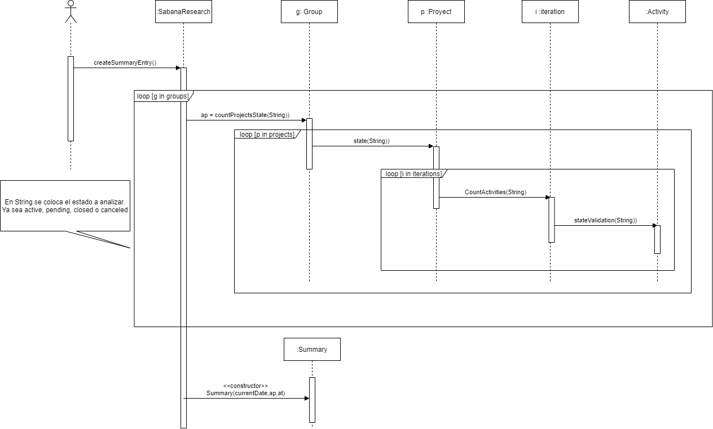
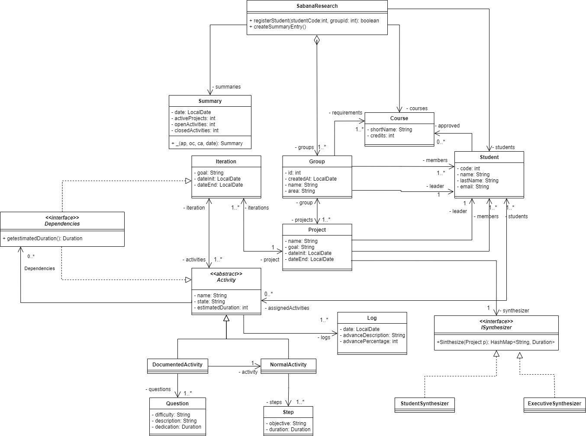

# Solución Primer parcial
## Conceptos
###¿Qué es encapsulamiento? ¿Qué ventajas ofrece?
El encapsulamiento es una forma de ocultar el estado de un objeto para así, obligar su interacción por medio de métodos. Esto ofrece una protección ya que podemos definir que se puede o no hacer con estos, evitando modificaciones inesperadas, descontroladas o datos erróneos. Así mismo, permite realizar funciones internas que no necesitamos que el usuario de software conozca.
###¿Qué es ocultación de información? ¿Por qué aplicarla? ¿Cómo se implementa en Java?
La ocultación de información es aquello que nos permite controlar la visibilidad de las propiedades de los objetos por medio del modificador de acceso (en el caso de java) private, que se escribe al principio del atributo/método. Este únicamente permite el acceso a los métodos y atributos de la misma clase, permitiendo así, encapsular ciertos aspectos deseados que generaran una mayor confiabilidad y seguridad en el código al protegerse de cambios inesperados o descontrolados.
## Memoria

## Diseño

## Bono

## Evidencia

#Solución segundo  parcial 

## Conceptos
### ¿Cuáles son las acciones los tres momentos importantes de las excepciones? ¿Cuál es el objetivo de cada una? ¿Cómo se implementa en Java cada acción?.
Como primer momento, una excepción es lanzada utilizando la palabra reservada throw que romperá el código. Esta simplemente informara de manera local que se generó una excepción. Seguido, esta se propaga mediante la palabra reservada throws (se coloca después de definir los parámetros de un método) que sirve para que todos los métodos que lo llamen puedan tomar acciones respecto a esa excepción. Finalmente, se controla la excepción utilizando el comando try- catch que llamara al método o métodos deseados y controlara (imprimiendo la excepción, modificando algo en el método, etc) respectivamente.

### ¿Qué es sobre-escritura de métodos? ¿Por qué aplicarla? ¿Cómo impedir que se sobre-escriba un método?.
La sobre escritura de métodos es un aspecto muy importante que aplica en el concepto de herencia. Pues consideramos que existe una clase padre que define ciertos atributos y métodos, de esta, una o varias clases pueden heredar tanto sus comportamientos como sus atributos dependiendo de los modificadores de acceso utilizados. Entonces, estos “hijos” pueden mantener el comportamiento de uno o varios métodos o pueden realizar una sobre escritura en algunos o todos ellos.
Esto, en resumen, permite que un método heredado sea modificado para cambiar parcial o completamente su comportamiento dependiendo de lo requerido. Para realizarlo, simplemente se escribe el encabezado del método a modificar de igual manera en la clase hija y se recomienda colocar una etiqueta de @Override. En caso contrario, donde no deseemos permitir que algún método se sobre escriba utilizaremos la palabra final que evitara este comportamiento. 

## Diseñando 
1. El método summarize de la clase project llama al sintetizador para que realize el resumen e imprime los valores devueltos.
   
`public HashMap<String, Duration> summarize()`
   * Devuelve: HashMap con el resumen requerido. 
2. El método synthesize en la clase StudentSynthesizer devuelve la información del tiempo invertido por cada estudiante en el proyecto.

`public HashMap<String, Duration> synthesize(Project project)` 

* Parámetro: `project` proyecto a sintetizar.

* Devuelve: Un Hashmap con los objetivos y sus respectivos tiempos.

3. En la clase ExecutiveSynthesizer, el método synthesize tiene la misma firma que el de estudiantes, pero devuelve el objetivo y la duración de cada una de las iteraciones del proyecto dado.

### Diagramas de secuencia

### Diagrama de clases

## Extendiendo

+ Se debería cambiar el método `getDuration()` para las 
clases que heredan de Activity. Esto con el objetivo de considerar los tiempos de las dependencias.

* No se debería cambiar el funcionamiento del método `synthesize()` ya que este funcionaría con el único cambio del 
`getDuration()`. Además, el método `summarize()` tampoco tendría que cambiarse dado que este no depende 
  directamente de la duración. 
  
Teniendo en cuenta esto, se podría decir que en general el diseño fue bueno dado que 
permitiría realizar el cambio planteado de una manera sencilla sin generar una dispersión de 
errores. Lo que si podría mejorarse es el encapsulamiento de la clase Project, ya que al sintetizar brinda
la clase completa y no los arreglos necesarios. 

## Evidencias Bono

