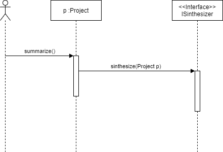
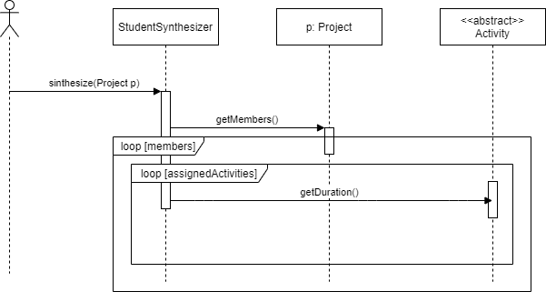
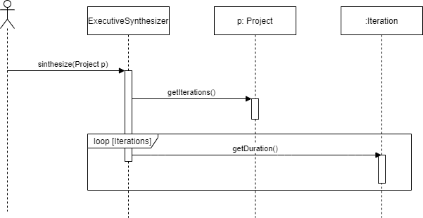
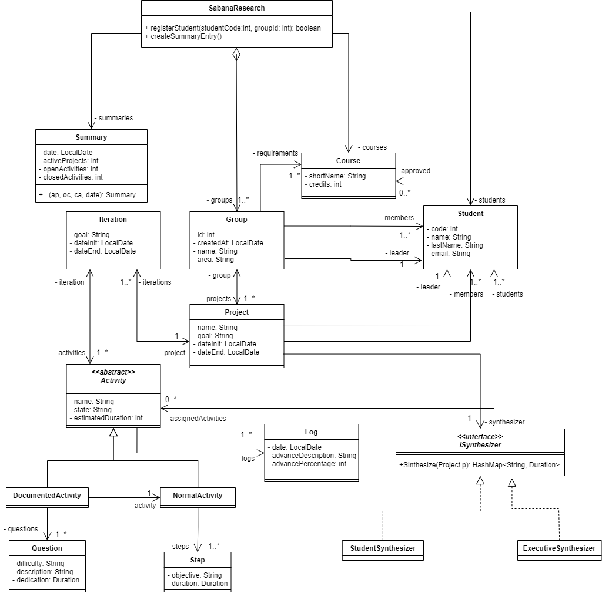

#Solución segundo  parcial 

##Conceptos
###¿Cuáles son las acciones los tres momentos importantes de las excepciones? ¿Cuál es el objetivo de cada una? ¿Cómo se implementa en Java cada acción?.
Como primer momento, una excepción es lanzada utilizando la palabra reservada throw que romperá el código. Esta simplemente informara de manera local que se generó una excepción. Seguido, esta se propaga mediante la palabra reservada throws (se coloca después de definir los parámetros de un método) que sirve para que todos los métodos que lo llamen puedan tomar acciones respecto a esa excepción. Finalmente, se controla la excepción utilizando el comando try- catch que llamara al método o métodos deseados y controlara (imprimiendo la excepción, modificando algo en el método, etc) respectivamente.

###¿Qué es sobre-escritura de métodos? ¿Por qué aplicarla? ¿Cómo impedir que se sobre-escriba un método?.
La sobre escritura de métodos es un aspecto muy importante que aplica en el concepto de herencia. Pues consideramos que existe una clase padre que define ciertos atributos y métodos, de esta, una o varias clases pueden heredar tanto sus comportamientos como sus atributos dependiendo de los modificadores de acceso utilizados. Entonces, estos “hijos” pueden mantener el comportamiento de uno o varios métodos o pueden realizar una sobre escritura en algunos o todos ellos.
Esto, en resumen, permite que un método heredado sea modificado para cambiar parcial o completamente su comportamiento dependiendo de lo requerido. Para realizarlo, simplemente se escribe el encabezado del método a modificar de igual manera en la clase hija y se recomienda colocar una etiqueta de @Override. En caso contrario, donde no deseemos permitir que algún método se sobre escriba utilizaremos la palabra final que evitara este comportamiento. 

##Diseñando 
1. El método summarize de la clase project llama al sintetizador para que realize el resumen e imprime los valores devueltos.
   
`public HashMap<String, Duration> summarize()`
   * Devuelve: HashMap con el resumen requerido. 
2. El método synthesize en la clase StudentSynthesizer devuelve la información del tiempo invertido por cada estudiante en el proyecto.

`public HashMap<String, Duration> synthesize(Project project)` 

* Parámetro: `project` proyecto a sintetizar.

* Devuelve: Un Hashmap con los objetivos y sus respectivos tiempos.

3. En la clase ExecutiveSynthesizer, el método synthesize tiene la misma firma que el de estudiantes, pero devuelve el objetivo y la duración de cada una de las iteraciones del proyecto dado.

###Diagramas de secuencia

###Diagrama de clases

